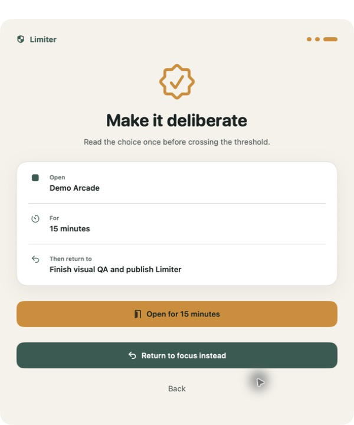
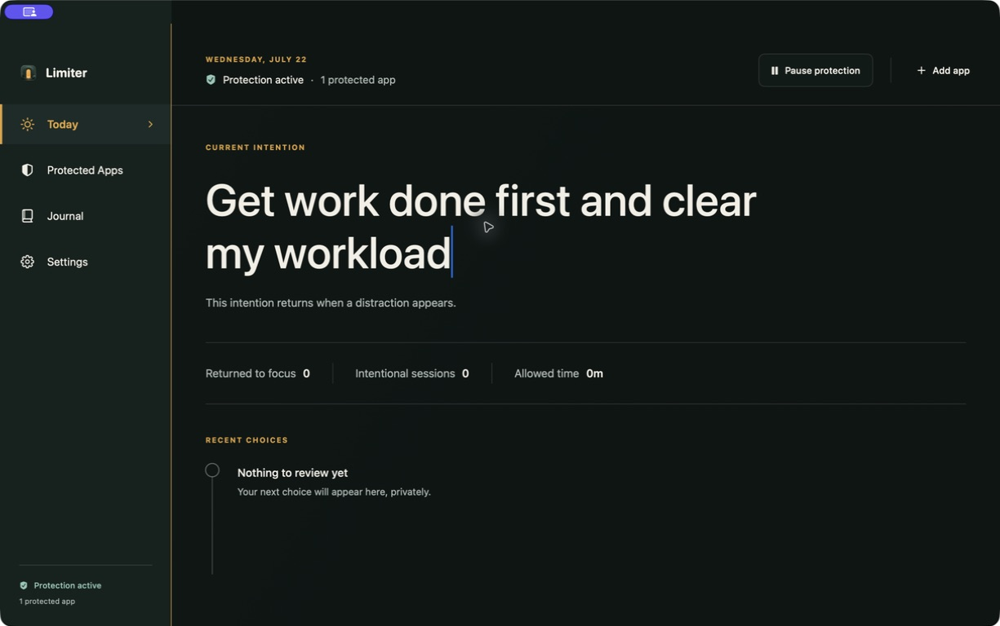

# Limiter


Limiter is a private, open-source macOS utility that puts a deliberate pause between opening a distracting app and losing the next few hours.

It does not replace Spotlight. Keep pressing Command–Space and opening apps normally. When a selected app launches or comes to the front, Limiter hides or asks it to close normally, then presents a short reflection before granting a time-bounded session.





## What works today

- Five-step first-run setup with installed-app discovery and manual app selection
- Launch and activation monitoring through public AppKit APIs
- A ten-second pause, reason prompt, current intention, duration choice, and final commitment
- Independent 1–60 minute grants for multiple protected apps
- One-minute warning by default, normal quit at expiry, and a two-minute save-dialog grace period
- Menu-bar status, local journal, CSV export, appearance controls, and Open at Login
- A 30-second reflection before pausing protection or quitting Limiter
- Local-only SwiftData storage with no account, server, analytics, advertisements, or telemetry
- Universal Apple Silicon and Intel DMG builds

Limiter never force-quits another app. It does not request Accessibility, Screen Recording, Input Monitoring, administrator access, or permission to read keystrokes.

## Download and install

Download `Limiter-0.1.2.dmg` from [GitHub Releases](https://github.com/Srikamarthapu/Limiter/releases), then:

1. Open the DMG and drag Limiter into Applications.
2. In Applications, Control-click Limiter and choose **Open**.
3. Confirm macOS's first-open warning.
4. Complete setup and optionally enable **Open Limiter at login**.

This side-project build is ad-hoc signed, not Developer ID notarized. See [the full installation and uninstall guide](docs/INSTALL.md), including how to verify the SHA-256 checksum.

## Safety and limitations

Limiter is a user-space focus aid. It is not parental control, security software, or medical treatment, and it is intentionally possible to pause, quit, or uninstall.

macOS does not expose Screen Time app shielding to native third-party Mac apps. Limiter therefore reacts to public workspace launch and activation events. A target app may briefly appear before Limiter contains it, an app can refuse a normal quit request, and a determined user can bypass Limiter by quitting it. These are explicit product boundaries, not hidden failure modes.

Because Limiter never force-quits, an app that refuses normal termination is hidden after its closing grace period and gated the next time it activates. Always save important work normally.

Read [PRIVACY.md](PRIVACY.md) and [SECURITY.md](SECURITY.md) before reporting privacy or security concerns.

## Build from source

Requirements:

- macOS 14 or later
- Xcode 16.4 or later with Swift 6

```bash
git clone https://github.com/Srikamarthapu/Limiter.git
cd Limiter
swift test
./scripts/package-app.sh
```

The packaging script builds both `arm64` and `x86_64`, creates an ad-hoc hardened-runtime signature, produces `dist/Limiter-<version>.dmg`, and writes its SHA-256 checksum. Derived build products live under `~/Library/Caches/LimiterBuild`, so the project can also be checked out on ExFAT storage.

For local installation after packaging:

```bash
./scripts/install-local.sh
```

## Project structure

- `Sources/Limiter/App`: application lifecycle, state coordination, and overlay panel
- `Sources/Limiter/Services`: app discovery, workspace monitoring, application control, login item, and export
- `Sources/Limiter/Views`: onboarding, dashboard, intervention, journal, settings, and menu bar
- `Sources/Limiter/Models`: SwiftData entities, preferences, and product state
- `Tests/LimiterTests`: deterministic policy, grant, preference, and export tests

See [Design and motion](docs/DESIGN.md), [Architecture](docs/ARCHITECTURE.md), [Contributing](CONTRIBUTING.md), and [Release process](docs/RELEASE.md) for details.

## License

Limiter is available under the [MIT License](LICENSE).
